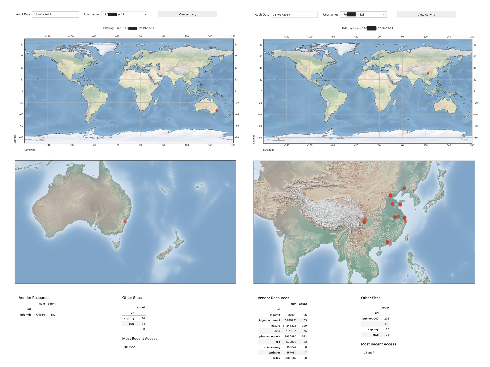

# EzProxy Daily : Users : Successful Logins

***This collections of scripts run best in Jupyter, either on a local machine or on a server you have file access to.***

***This readme file is for ezproxy\_daily\_users.ipynb*** 

To review users accessing EzProxy and whether they are chaining multiple sessions, make sure you place the audit logs into the /data folder and that they are named in the syntax of "YYYYMMDD.txt" (for example, "20190314.txt"). These audit files are usually in the /audit sub-folder of your EzProxy application folder on the server. Your audit logs will need to be in the following format:

> **%h %{ezproxy-session}i %u %t "%r" %s %b**

Please also maked sure that you place the EzProxy log files in the /data_e folder and that they are named in the syntax of "ezproxyYYYYMMDD.log" (for example, "ezproxy20190101.log"). These ezproxy files are usually in the /log sub-folder of your EzProxy application folder on the server. Your EzProxy logs will need to be in the following format, which is slightly different from the audit log format:

> **%h %{ezproxy-session}i %U %u %t "%r" %s %b**

Once you have some files in the approprate data files, *run cells 1 through to 8*. If there are no warnings or errors, then you will be presented with a calendar dropdown menu, from which you can select the date for audting. Once you select a date, it will read the audit log and then refresh with a 'username' dropdown, which presents users with the number of sessions they have held on the day in question. From this, you can select a user to review their activity based on the number of sessions they have generated. Usual bahaviour rarely goes into double digits; suspicious behaviour is always into double digits and often stands out from the rest of the list. In the image below, there are two users which warranted a review: one was legitimate (left side), the other was not legitimate and the user had to be contacted after their username was blocked (right side)

Once you select a username, the program will take a little moment to visualise where the user logged into EzProxy and where the user operated from after their logging in session was authenticated by EzProxy. In normal circumstances, both locations will match but in suspicious circumstances you may find that there are differences in locations or one location for logging in and multiple locations for general use. The latter scenario is usually indicative of the session being proxied out to other users (which sites like 'pubmed007' often do). You can verify this by clicking on the 'View Activity' button. This will generate a high-level list of resources accessed and other sites appearing in the logs. It is in the 'Other Sites' list where you will see any sites like 'pubmed007' or '2447.net'.
