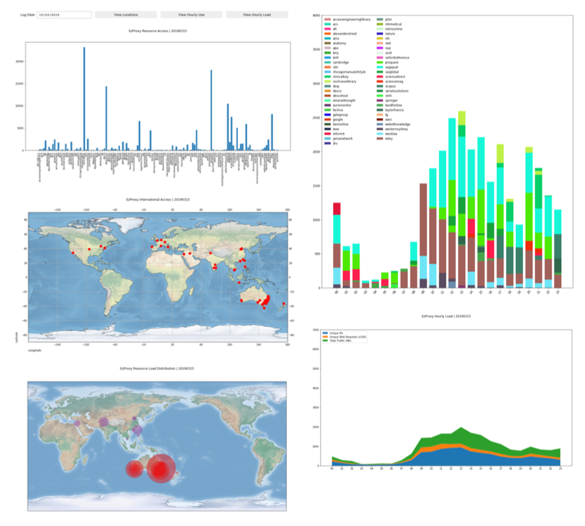

# EzProxy Daily : Resources

***This runs best in Jupyter, either on a local machine or on a server you have file access to.*** 

To review total use of EzProxy, make sure you place the audit logs into the /data folder and that they are named in the syntax of "YYYYMMDD.txt" (for example, "20190314.txt"). These audit files are usually in the /audit sub-folder of your EzProxy application folder on the server. Your audit logs will need to be in the following format:

> **%h %{ezproxy-session}i %u %t "%r" %s %b**

Please also maked sure that you place the EzProxy log files in the /data_e folder and that they are named in the syntax of "ezproxyYYYYMMDD.log" (for example, "ezproxy20190101.log"). These ezproxy files are usually in the /log sub-folder of your EzProxy application folder on the server. Your EzProxy logs will need to be in the following format, which is slightly different from the audit log format:

> **%h %{ezproxy-session}i %U %u %t "%r" %s %b**

Once you have some files in the approprate data folders, *run cells 1 through to 9*. If there are no warnings or errors, then you will be presented with a calendar dropdown menu, from which you can select the date for review. Once you select a date, it will read the logs and provide options for the following views. Keep in mind that because there will be thousands of IP addresses to query, it will take a very long time to obtain results. Best to run the script and come back to it an hour later.

